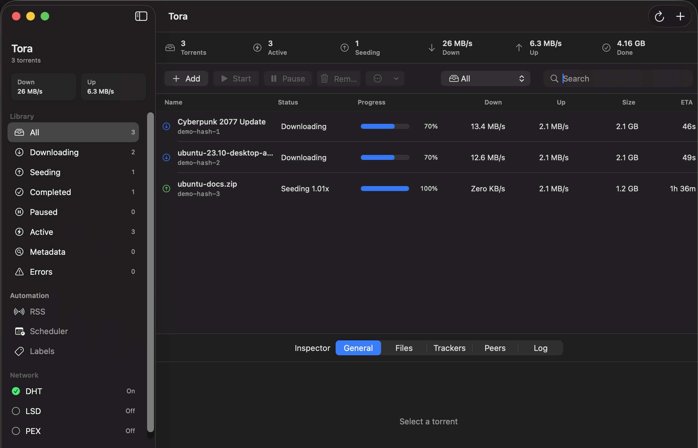
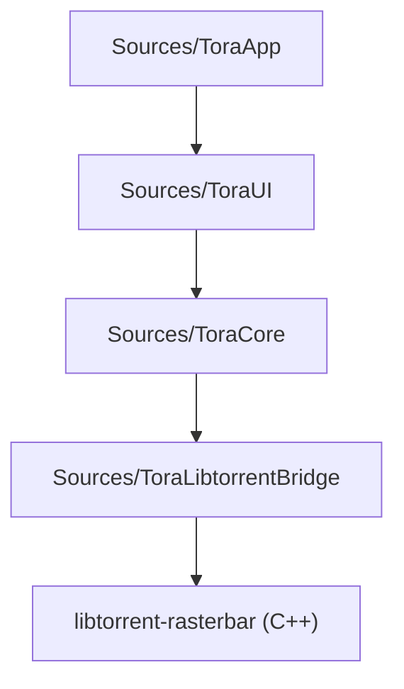

<p align="center">
  
</p>

<h1 align="center">Tora</h1>

<p align="center">
  <strong>A premium, security-first, macOS-native BitTorrent client built with Swift, SwiftUI, and libtorrent-rasterbar.</strong>
</p>

<p align="center">
  
  
  
  
</p>

<p align="center">
  
</p>

---

## Status

Tora is currently in early active development. The security-first project skeleton, validation layers, dynamic bridge boundary, CI workflow, and automated production packaging pipelines are fully implemented and ready.

## Security Posture

Unlike generic clients, Tora is built on a fail-closed, secure-by-default architecture:

* 🔒 **Isolated Engine**: Libtorrent is strictly isolated behind a thin `TorrentService` boundary. No raw handles can escape.
* 🛡️ **Path Validation**: Download and save paths are recursively validated to prevent filesystem traversals or system directory pollution.
* 🚫 **No Auto-Opening**: Tora will never automatically open or execute downloaded files.
* 🔏 **Sandbox Boundary**: The app defaults to a dedicated downloads sandbox folder: `~/Downloads/Tora`.
* 🔌 **Fail-Closed Connections**: Local network-discovery settings (LPD, UPnP, NAT-PMP) are disabled by default and require explicit review to enable.

---

## Quick Start

### Build Requirements
* macOS Sonoma (14.0) or newer
* Xcode 15 / Swift 5.10+
* Homebrew (for libtorrent engine bindings)

### 1. Development Build (Fail-Closed)
To run a fast, fail-closed development build without installing external system dependencies:
```sh
swift test
swift run Tora
```
*Note: In this mode, calls requiring libtorrent will return a safe mock response until linked.*

### 2. Full Build (Libtorrent-Enabled)
Install libtorrent and build with linked bindings:
```sh
brew install libtorrent-rasterbar
TORA_LIBTORRENT_PREFIX="$(brew --prefix libtorrent-rasterbar)" swift build
```

---

## Interactive Developer Manual

<details>
<summary><b>🛠️ Local Development Automation Scripts</b></summary>
<br>

Tora includes shell commands and Finder-friendly shortcuts for key development tasks:

| Command | File Path | Description |
| :--- | :--- | :--- |
| **Run Dev** | `Commands/dev.sh` | Builds and runs Tora from SwiftPM. |
| **Build Prod** | `Commands/prod.sh` | Compiles a production `.app`, runs ad-hoc code-signing, and launches it. |
| **Run Tests** | `Commands/test.sh` | Runs unit tests (with libtorrent-enabled tests if library is installed). |
| **Watch Files** | `Commands/watch.sh` | Automatically rebuilds and restarts Tora when source files change. |

*Finder Launchers are also available in `Commands/` as `.command` scripts (e.g., `Commands/Prod.command`) for quick double-click launching.*
</details>

<details>
<summary><b>⚓ Local Git Automation (Pre-commit / Pre-push Hooks)</b></summary>
<br>

To set up pre-commit validation (runs unit tests) and pre-push validation (runs full libtorrent build):
```sh
Scripts/install-git-hooks.sh
```
These hooks run automatically to verify code correctness before syncing upstream.
</details>

<details>
<summary><b>⚡ Technical Architecture: Libtorrent Bridge</b></summary>
<br>

Tora isolates unsafe C++ bindings using a structured bridge boundary:

* **Protocol Isolation**: The Swift app depends exclusively on `TorrentServiceProtocol`.
* **Zero C++ Leaks**: All raw C++ pointers, standard containers (`std::vector`), and Libtorrent types are fully contained inside `Sources/ToraLibtorrentBridge` to prevent runtime undefined behaviors or memory leaks in Swift code.
</details>

---

## License

Tora is licensed under the [MIT License](LICENSE).
For security concerns, please refer to our [Security Policy](SECURITY.md).
